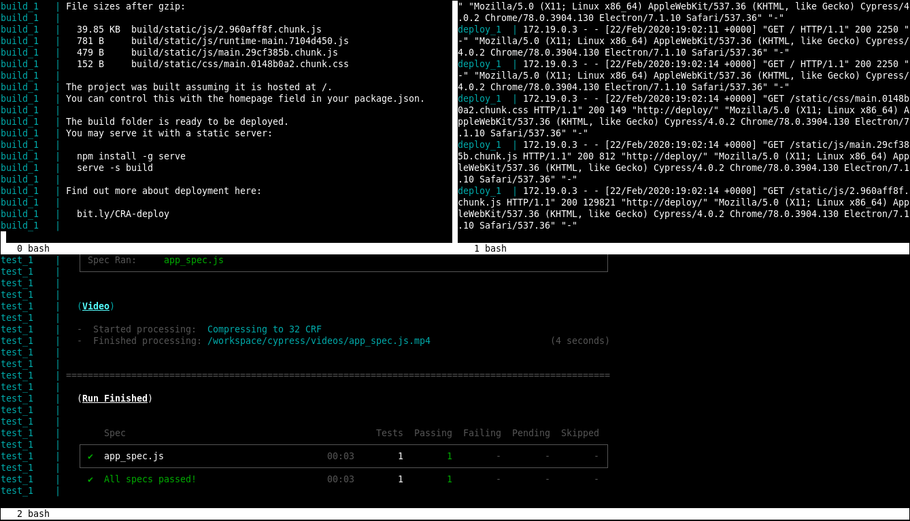

# react-similarity-network

Similarity graph for Foursquare places. Crawls through venue connections,
recursively drawing links between them and their peers.


## Installation

After cloning the sources you can choose to run the pipeline in Docker
containers or locally, with NPM. Information on how to install Docker and
docker-compose can be found in their [official page][install-docker-compose].
The same page is available for [Node and NPM][install-node].

```bash
git clone https://github.com/marcbperez/react-similarity-network
cd react-similarity-network
```

If you decide to use NPM without Docker, make sure to install the project
dependencies. Skip this otherwise, since the containers will do this
automatically.

```bash
npm install
```

## Usage

If you are using Docker, you start the build, deployment and end-to-end test
services at the same time or independently.

```bash
# Start the build, deployment and end-to-end test services
sudo docker-compose up
```

The build container starts the development server on `http://localhost:3000` and
unit-tests, documents and builds the application every time the `src` or
`public` folders change. The deploy container starts a dummy deployment
environment on `http://localhost:8000`, exposing the files from the `build`
folder. The test container starts an end-to-end Cypress service that checks
`CYPRESS_BASEURL`, which points to the deploy service by default.

```bash
# Start the development server and the build pipeline.
sudo docker-compose up build
# Start the dummy deployment environment.
sudo docker-compose up deploy
# End-to-end test the dummy deployment environment.
sudo docker-compose up test
```

With NPM, the commands invoked by the Docker containers include `npm install`
and the ones defined in `package.json`. These include commands to manage the
pipeline and the ones initially provided by create-react-app.

```bash
# Starts a development server in port 3000.
npm start
# Runs unit and integration tests.
npm test
# Generates the production build in the `build` folder.
npm run build
# Generates a coverage report in the `coverage` folder.
npm run cover
# Documents the project inside the `docs` folder.
npm run document
# Covers, documents and builds the project.
npm run pipeline
# Watches for changes in `src` and `public` and runs the pipeline.
npm run watch
```

## Testing

In Docker, unit tests with coverage report are executed every time the code
changes. As for the end-to-end tests, the Cypress service will check
`CYPRESS_BASEURL` every time `build` changes. If tests fail, a screenshot will
be exported to `cypress/screenshots`. If they pass, the video will be available
in `cypress/videos`.

With NPM, `npm test` will unit-test the codebase, and `npm run cover` will test
and output a coverage report into the `coverage` folder, as described above.
End-to-end testing without Docker is not yet implemented and will be added in
future a release.



## Deployment

The react app can be deployed to a static web server by publishing the `build`
folder. Also, the deployment container can be pushed into a registry defined in
`docker-compose.yml` after the `build` folder has been generated.

```bash
sudo docker-compose push deploy
```

To run end-to-end tests against your new deployed environment, run the Cypress
service with the updated `CYPRESS_BASEURL`.

## Troubleshooting

The [issue tracker][issue-tracker] intends to manage and compile bugs,
enhancements, proposals and tasks. Reading through its material or reporting to
its contributors via the platform is strongly recommended.

## Contributing

This project adheres to [Semantic Versioning][semver] and to certain syntax
conventions defined in [.editorconfig][editorconfig]. To get a list of changes
refer to the [CHANGELOG][changelog]. Only branches prefixed by feature-,
hotfix-, or release- will be considered:

  - Fork the project.
  - Create your new branch: `git checkout -b feature-my-feature develop`
  - Commit your changes: `git commit -am 'Added my new feature.'`
  - Push the branch: `git push origin feature-my-feature`
  - Submit a pull request.

## Credits

This project is created by [marcbperez][author] and maintained by its
[author][author] and contributors.

## License

This project is licensed under the [Apache License Version 2.0][license].

[author]: https://marcbperez.github.io
[issue-tracker]: https://github.com/marcbperez/react-similarity-network/issues
[editorconfig]: .editorconfig
[changelog]: CHANGELOG.md
[license]: LICENSE
[semver]: http://semver.org
[install-docker-compose]: https://docs.docker.com/compose/install/
[install-node]: https://nodejs.org/en/download/
